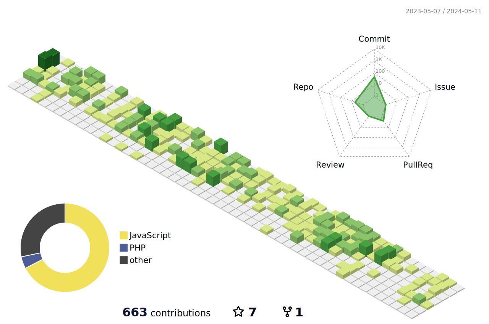

### Hi there 👋

I'm Mohamed Kamel, a seasoned Software Engineer with over 6 years of experience in web development. Throughout my career, I have successfully navigated various architectural styles including Monolithic, Modular Monolithic, SOA, and Microservices using popular technologies such as PHP, Laravel, Node.js, Express.js, and Nest.js.

I thrive on tackling new challenges and crafting innovative system designs.

#### These are my contributions to opensource projects:-
- [belongs-to-through](https://github.com/staudenmeir/belongs-to-through/pull/89)
- [Doctrine ODM](https://github.com/muhammedkamel/lumen-doctrine-mongodb-odm)
- [RabbitMQ](https://github.com/muhammedkamel/rabbitmq)

---

